# PADEL BUSINESS MANAGEMENT PLATFORM — Arquitectura Técnica

> Estado de esta entrega: **FASES 1-8 y 11-13 completadas y verificadas**.
>
> **Datos** — 24 migraciones SQL reales contra PostgreSQL 16: 59 tablas, 15 vistas,
> 236 índices, 220 políticas RLS, 110 triggers, 39 enums, 136 permisos, 344 constraints.
>
> **Aplicación** — Next.js 15 (App Router) + React 19 + TypeScript + Tailwind:
> 37 páginas conectadas a datos reales, 8 Server Actions, build de producción limpio.
>
> **Verificación** — 40 aserciones de negocio, suite completa de aislamiento RLS y
> 52 consultas reales del frontend ejecutadas vía PostgREST con el JWT de cada rol.
> Todo en verde.

---

## 0. Índice

| # | Entregable exigido (§132) | Dónde está |
|---|---|---|
| 1 | Diagrama ERD | §2 de este documento |
| 2 | Lista definitiva de tablas | §3 |
| 3 | Campos de cada tabla | migraciones `supabase/migrations/*.sql` (SQL real, comentado) |
| 4 | Foreign Keys | §3 + SQL |
| 5 | Índices | §9 |
| 6 | Enums | §4 |
| 7 | Constraints | §10 |
| 8 | Views | §7 |
| 9 | Functions | §6 |
| 10 | Triggers | §8 |
| 11 | Estrategia RLS | §11 |
| 12 | Roles | §12 |
| 13 | Permisos | §12 |
| 14 | Estructura Next.js | §14 |
| 15 | Estructura Supabase | §13 |
| 16 | Estrategia Storage | §13 |
| 17 | Flujo de negocio | §5 |
| 18 | Definición de KPIs | §15 |
| 19 | Arquitectura de IA | §16 |
| 20 | Plan de implementación | §18 |

---

## 1. Principios de arquitectura

Cinco decisiones gobiernan todo el resto. Están tomadas explícitamente y el código las respeta sin excepción.

**1.1 · La base de datos es el sistema, no un almacén.**
Los cálculos financieros, la trazabilidad y las reglas de estado viven en PostgreSQL: funciones, triggers y vistas. El frontend consume, presenta y captura; no decide. Si mañana se reemplaza Next.js por otra cosa, el negocio sigue funcionando igual.

**1.2 · La seguridad vive en PostgreSQL, no en React.**
Cada tabla operacional tiene RLS activo. Aunque un desarrollador olvide el `where project_id = ...`, la base **no devuelve** filas de otro proyecto. Esto está probado: `supabase/tests/02_rls_security.sql` consulta sin filtro alguno y comprueba que el aislamiento se mantiene.

**1.3 · No se duplica lo que se puede derivar.**
`sales` guarda importes (se consultan y ordenan constantemente, por eso se materializan vía trigger desde `sale_items`). Los **costos y márgenes no se guardan**: se derivan en `v_sale_financials`. Cuando el negocio necesita congelar un margen histórico (cierre mensual, comité), se escribe explícitamente en `sale_margin_snapshots`. Un número derivado nunca puede quedar desincronizado.

**1.4 · `project_id` en todo, y verificado por trigger.**
Toda entidad operacional lleva `project_id`. Además, un trigger de coherencia multi-tenant (`app.tg_enforce_parent_project`) impide que una fila apunte a un padre de otro proyecto: no se puede crear una factura de EUROPA contra una venta de ATILA, ni por error ni a propósito.

**1.5 · `sale_id` es el eje económico.**
Cliente → venta → canchas → fabricación → materiales → compras → costos → logística → instalación → factura → pago → margen. Todo cuelga de la venta, y por eso la rentabilidad real de cada operación es una consulta, no un ejercicio de reconstrucción.

---

## 2. Diagrama ERD

```mermaid
erDiagram
    PROJECTS ||--o{ USER_PROJECT_ACCESS : "otorga acceso"
    PROFILES ||--o{ USER_PROJECT_ACCESS : "tiene rol en"
    ROLES ||--o{ USER_PROJECT_ACCESS : "define"
    ROLES ||--o{ ROLE_PERMISSIONS : "agrupa"
    PERMISSIONS ||--o{ ROLE_PERMISSIONS : "otorga"
    PROJECTS ||--o{ PROJECT_MODULES : "habilita"

    PROJECTS ||--o{ CLIENTS : "aisla"
    CLIENTS ||--o{ CONTACTS : "tiene"
    CLIENTS ||--o{ OPPORTUNITIES : "genera"
    OPPORTUNITIES ||--o{ COMMERCIAL_ACTIVITIES : "registra"
    OPPORTUNITIES ||--o{ MEETINGS : "agenda"
    OPPORTUNITIES ||--o{ FOLLOW_UPS : "requiere"

    OPPORTUNITIES ||--o| SALES : "se convierte en"
    CLIENTS ||--o{ SALES : "compra"
    SALES ||--o{ SALE_ITEMS : "detalla"
    SALES ||--o{ SALE_COSTS : "presupuesta y devenga"
    SALES ||--o{ SALE_MARGIN_SNAPSHOTS : "congela"
    COST_CATEGORIES ||--o{ SALE_COSTS : "clasifica"

    SALES ||--o{ MANUFACTURING_PROJECTS : "dispara"
    SALES ||--o{ COURTS : "compromete"
    MANUFACTURING_PROJECTS ||--o{ COURTS : "produce"
    COURTS ||--o{ COURT_STATUS_HISTORY : "audita"
    MANUFACTURING_PROJECTS ||--o{ MATERIAL_REQUIREMENTS : "necesita"
    MATERIALS ||--o{ MATERIAL_REQUIREMENTS : "define"
    MATERIAL_REQUIREMENTS ||--o{ MATERIAL_PURCHASES : "cubre"

    SUPPLIERS ||--o{ SUPPLIER_QUOTES : "cotiza"
    SUPPLIER_QUOTES ||--o{ SUPPLIER_QUOTE_ITEMS : "detalla"
    SUPPLIERS ||--o{ PURCHASE_ORDERS : "recibe"
    PURCHASE_ORDERS ||--o{ PURCHASE_ORDER_ITEMS : "detalla"

    SALES ||--o{ CONTRACTS : "formaliza"
    SALES ||--o{ INVOICES : "factura"
    PURCHASE_ORDERS ||--o{ INVOICES : "factura"
    INVOICES ||--o{ INVOICE_ITEMS : "detalla"
    INVOICES ||--o{ PAYMENTS : "cobra o paga"
    BANK_ACCOUNTS ||--o{ PAYMENTS : "canaliza"
    BANK_ACCOUNTS ||--o{ BANK_TRANSACTIONS : "registra"
    SALES ||--o{ EXPENSES : "imputa"

    SALES ||--o{ SHIPMENTS : "embarca"
    SHIPMENTS ||--o{ SHIPMENT_ITEMS : "contiene"
    COURTS ||--o{ SHIPMENT_ITEMS : "viaja en"
    SALES ||--o{ INSTALLATIONS : "instala"
    INSTALLATIONS ||--o{ INSTALLATION_COURTS : "monta"
    COURTS ||--o{ INSTALLATION_COURTS : "se instala en"
    INSTALLATIONS ||--o{ QUALITY_CHECKS : "controla"
    COURTS ||--o{ QUALITY_CHECKS : "verifica"

    DOCUMENT_TYPES ||--o{ DOCUMENTS : "clasifica"
    DOCUMENTS ||--o{ DOCUMENT_LINKS : "se asocia a N entidades"
    DOCUMENTS ||--o{ DOCUMENT_VERSIONS : "versiona"
    DOCUMENTS ||--o{ AI_DOCUMENT_EXTRACTIONS : "se procesa por IA"

    PROJECTS ||--o{ ALERTS : "detecta"
    ALERTS ||--o{ TASKS : "se convierte en"
    ALERTS ||--o{ NOTIFICATIONS : "notifica"
    PROJECTS ||--o{ PROJECT_EVENTS : "timeline"
    PROJECT_CHECKLISTS ||--o{ CHECKLIST_ITEMS : "contiene"
```



### Cadena de trazabilidad (§5, §50, §130)

```
DASHBOARD → VENTA → CANCHA → FABRICACIÓN → MATERIALES → COMPRAS
                 ↘ COSTOS → MARGEN
                 ↘ LOGÍSTICA → ADUANA → INSTALACIÓN → ENTREGA
                 ↘ CONTRATO → FACTURA → PAGO → COBRO
                 ↘ DOCUMENTOS (en cualquier punto, vía document_links)
```

Cada flecha existe físicamente como foreign key indexada. La navegación drill-down del frontend no necesita joins improvisados.

---

## 3. Lista definitiva de tablas (59)

### Núcleo y seguridad (9)
| Tabla | Propósito | FKs principales |
|---|---|---|
| `projects` | Unidades de negocio (EUROPA / ATILA / VENTA_USADAS) | — |
| `modules` | Catálogo maestro de módulos | — |
| `project_modules` | Módulos habilitados por proyecto | `project_id`, `module_code` |
| `document_sequences` | Correlativos atómicos por proyecto/tipo/año | `project_id` |
| `profiles` | Perfil de negocio del usuario | `auth.users`, `roles` |
| `roles` | ADMIN, GERENCIA, COMERCIAL, OPERACIONES, FINANZAS, LECTURA | — |
| `permissions` | 136 permisos `module.action` | `module_code` |
| `role_permissions` | Rol → permisos | `roles`, `permissions` |
| `user_project_access` | **Fuente única de verdad de RLS**: usuario × proyecto × rol | `profiles`, `projects`, `roles` |

### CRM (6)
`clients`, `contacts`, `opportunities`, `commercial_activities`, `meetings`, `follow_ups`

### Ventas y rentabilidad (5)
`sales`, `sale_items`, `cost_categories`, `sale_costs`, `sale_margin_snapshots`

### Fabricación y canchas (3)
`manufacturing_projects`, `courts`, `court_status_history`

### Materiales y compras (7)
`materials`, `material_requirements`, `material_purchases`, `suppliers`, `supplier_quotes`, `supplier_quote_items`, `purchase_orders` (+ `purchase_order_items`)

### Finanzas (9)
`exchange_rates`, `contracts`, `invoices`, `invoice_items`, `payments`, `expenses`, `bank_accounts`, `bank_transactions`, (`cost_categories` compartida)

### Logística e instalación (5)
`shipments`, `shipment_items`, `installations`, `installation_courts`, `quality_checks`

### Documentación e IA (6)
`document_types`, `documents`, `document_links`, `document_versions`, `ai_document_extractions`, `approvals`

### Operación, alertas y auditoría (9)
`project_events`, `checklist_templates`, `checklist_template_items`, `project_checklists`, `checklist_items`, `tasks`, `alerts`, `notifications`, `audit_logs`

**Convención universal.** Toda tabla principal: `id UUID PK`, `created_at`, `updated_at` (mantenido por trigger). Entidades críticas (clientes, ventas, canchas, proyectos, proveedores, documentos, facturas, contratos): `deleted_at` — **nunca se borra información financiera histórica**.

---

## 4. Enums (39)

Se usan **ENUMs nativos** para máquinas de estado estables, y **tablas de catálogo** para lo que el ADMIN debe poder administrar desde la UI (categorías de costo, tipos de documento, materiales, módulos, plantillas de checklist). Es la línea divisoria: si cambiarlo requiere pensar en el código, es enum; si es configuración de negocio, es tabla.

| Grupo | Enums |
|---|---|
| Generales | `currency_code` (EUR/USD/ARS/CLP), `priority_level`, `entity_type` (27 valores) |
| CRM | `client_status`, `lead_source`, `opportunity_status`, `activity_type`, `meeting_type`, `meeting_status`, `follow_up_status` |
| Ventas | `sale_status`, `sale_item_type`, `cost_status` |
| Producción | `manufacturing_status`, `court_status`, `court_kind`, `physical_condition` |
| Compras | `supplier_status`, `quote_status`, `purchase_order_status` |
| Finanzas | `invoice_kind`, `invoice_status`, `payment_direction`, `payment_method`, `contract_status`, `bank_transaction_type`, `expense_status` |
| Logística | `shipment_status`, `customs_status`, `transport_mode` |
| Operación | `installation_status`, `quality_result`, `document_status`, `ai_extraction_status`, `approval_status`, `task_status`, `alert_type`, `alert_status`, `audit_action` |

### Estados de cancha: un enum, dos máquinas de estado

`court_status` unifica ambos ciclos y un **CHECK constraint** garantiza que cada tipo solo admita su conjunto válido:

```sql
constraint courts_status_domain_ck check (
  (court_type = 'NUEVA' and status in (
    'PLANIFICADA','MATERIALES_PENDIENTES','EN_CONSTRUCCION','CONSTRUCCION_TERMINADA',
    'GALVANIZADO','GALVANIZADO_TERMINADO','EMBALAJE','EMBALADA','EN_TRANSITO',
    'EN_INSTALACION','INSTALACION_TERMINADA','ENTREGADA','BAJA'))
  or
  (court_type = 'USADA' and status in (
    'DISPONIBLE','RESERVADA','EN_DESMONTAJE','DESMONTADA','EN_REPARACION',
    'PREPARADA','EN_TRANSPORTE','EN_TRANSITO','EN_INSTALACION',
    'INSTALACION_TERMINADA','ENTREGADA','VENDIDA','BAJA'))
)
```

Una cancha nueva **no puede** quedar en `EN_REPARACION` ni una usada en `GALVANIZADO`. La base lo impide, no la UI.

---

## 5. Flujo de negocio

### 5.1 Ciclo comercial → operativo → financiero

```
PROSPECTO → CLIENTE → OPORTUNIDAD → REUNIÓN → COTIZACIÓN → NEGOCIACIÓN
   → VENTA → CONTRATO → FABRICACIÓN → MATERIALES → GALVANIZADO → EMBALAJE
   → LOGÍSTICA → TRÁNSITO → ADUANA → INSTALACIÓN → ENTREGA
   → FACTURACIÓN → COBRO → MARGEN REAL
```

### 5.2 Confirmación de venta — una transacción, siete efectos

`public.confirm_sale(sale_id, create_manufacturing, delivery_date)` es la pieza central del sistema. Verifica el permiso `sales.approve`, valida el estado y, atómicamente:

1. Confirma la cabecera de la venta (`confirmed_at`).
2. Crea las **canchas** que faltan para cubrir lo vendido, con numeración automática (`EUROPA-0023`).
3. Crea el **proyecto de fabricación** (solo si el proyecto es de canchas nuevas).
4. Genera los **costos estimados** a partir del presupuesto de las líneas.
5. Instancia los **checklists** operacionales desde plantilla (venta y fabricación).
6. Cierra la **oportunidad** como GANADA.
7. Registra el **evento de timeline** y resuelve la alerta `VENTA_SIN_FABRICACION`.

Si cualquier paso falla, no ocurre ninguno. No hay estados intermedios inconsistentes.

### 5.3 Entrega parcial (caso §102)

Cuando una cancha cambia de estado, el trigger `courts_status_history` recalcula el estado de entrega de la venta mediante `app.sync_sale_delivery_status`:

- todas las canchas `ENTREGADA` → venta `ENTREGADA`
- algunas → venta `PARCIALMENTE_ENTREGADA`
- ninguna → venta `EN_PRODUCCION`

Verificado: venta de 2 canchas con una entregada y otra en tránsito queda automáticamente en `PARCIALMENTE_ENTREGADA`, y el dashboard muestra `1 entregada / 1 por entregar`.

### 5.4 Cascadas logísticas

- Embarque pasa a `EN_TRANSITO` → sus canchas pasan a `EN_TRANSITO`.
- Instalación pasa a `RECEPCIONADA` → sus canchas pasan a `ENTREGADA` (y eso, a su vez, actualiza el estado de la venta).

El operario cambia **un** estado y el sistema propaga la consecuencia real.

---

## 6. Funciones PostgreSQL

### API de negocio (esquema `public`, expuesta vía RPC, valida permisos)

| Función | Qué hace |
|---|---|
| `confirm_sale(uuid, boolean, date)` | Confirma venta y despliega toda la operación (§5.2) |
| `change_court_status(uuid, court_status, text)` | Cambia estado de cancha con comentario y propagación |
| `snapshot_sale_margin(uuid, text)` | Congela el margen del momento en `sale_margin_snapshots` |
| `create_task_from_alert(uuid, uuid, date)` | Convierte una alerta en tarea asignada (§116) |
| `convert_amount(numeric, currency, currency, date)` | Conversión de moneda **explícita**; devuelve NULL si no hay tasa |
| `get_session_context()` | Hidrata la sesión: usuario, proyectos, rol, módulos y permisos en 1 query |

### Internas (esquema `app`, no expuesto por PostgREST)

`log_event`, `upsert_alert`, `generate_alerts`, `refresh_overdue_follow_ups`, `create_checklist_from_template`, `sync_sale_delivery_status`, `recalculate_sale_totals`, `recalculate_invoice_totals`, `recalculate_invoice_payments`, `recalculate_po_totals`, `next_document_number`, y los helpers de seguridad `is_super_admin`, `accessible_project_ids`, `projects_with_permission`, `has_permission`, `has_project_access`, `role_in_project`, `storage_project_id`.

> El esquema `app` no está en la lista de esquemas expuestos de PostgREST. Un cliente **no puede** invocar `app.generate_alerts()` ni los helpers `SECURITY DEFINER`. Los `REVOKE EXECUTE` explícitos son la segunda línea de defensa.

### Nunca se convierte moneda a la ligera

```sql
select public.convert_amount(1000, 'EUR', 'USD');            -- 1085.00 (tasa registrada)
select public.convert_amount(1000, 'CLP', 'ARS', '2016-01-01'); -- NULL: no hay tasa
```

Si no existe una tasa con fecha y fuente, el sistema devuelve NULL. Prefiere admitir que no sabe antes que inventar una cifra financiera.

---

## 7. Vistas (15)

Todas con `security_invoker = on`: se ejecutan con los permisos del usuario, de modo que **RLS sigue aplicando dentro de la vista**. Un usuario de ATILA que consulte `v_dashboard_global` ve una sola fila.

| Vista | Pregunta de negocio que responde |
|---|---|
| **`v_sale_financials`** | *La vista central.* Por venta: total, costo estimado y real, facturado, cobrado, por cobrar, margen estimado / real / proyectado, canchas por estado, estado de entrega, banderas de margen bajo y sobrecosto |
| `v_sale_cost_variance` | Estimado vs real por categoría de costo (gráfico §52) |
| `v_sales_summary` | Agregados comerciales por proyecto y moneda |
| `v_court_status_summary` | Conteo y valor de canchas por estado |
| `v_manufacturing_summary` | Avance %, materiales faltantes, días al deadline, flag de atraso |
| `v_pipeline_summary` | Embudo comercial con pipeline ponderado por probabilidad |
| `v_accounts_receivable` | Cuentas por cobrar con *aging* (corriente / 1-30 / 31-60 / 61-90 / 90+) |
| `v_accounts_payable` | Cuentas por pagar con el mismo *aging* |
| `v_financial_summary` | Caja y deuda por proyecto |
| `v_project_profitability` | Rentabilidad agregada + conteo de ventas en riesgo |
| **`v_dashboard_global`** | Una fila por proyecto con **todos** los KPIs de cabecera |
| `v_client_360` | Ficha de cliente: contactos, pipeline, ventas, deuda, última actividad |
| `v_agenda` | Feed unificado de fechas (reuniones, seguimientos, instalaciones, despachos, entregas, vencimientos, tareas) → alimenta HOY, PRÓXIMOS 7 DÍAS y calendario |
| `v_control_center` | Alertas abiertas clasificadas en CRÍTICO / IMPORTANTE / PRÓXIMO |
| `v_used_courts_inventory` | Inventario de usadas: costo total, precio, margen por cancha |

### Margen real vs margen proyectado

Una venta recién confirmada tiene costo real 0. Calcular `margen real = venta - 0` da **100%**: matemáticamente cierto, gerencialmente engañoso. Por eso `v_sale_financials` expone tres cifras:

- `estimated_margin` — contra el presupuesto (de `sale_costs`, o de las líneas de venta si aún no se ha costeado en detalle).
- `actual_margin` + `has_actual_cost` — el real puro, con la bandera para saber si significa algo.
- **`projected_margin`** — usa el costo real donde ya existe y el estimado donde todavía no. **Es el número que debe mirar gerencia**, y el que usa el dashboard.
- `cost_recognition_pct` — cuánto del presupuesto ya tiene costo real imputado.

---

## 8. Triggers (110)

| Familia | Qué garantiza |
|---|---|
| `updated_at` | Toda tabla mantiene su marca de tiempo sin depender del cliente |
| Numeración | `EUROPA-2026-0014`, `FV-…`, `OC-…`, `SH-…`, `INS-…`, `EUROPA-0023` — atómicos por proyecto/año |
| Recálculo | Totales de venta, factura y OC derivados de sus líneas; `paid_amount` y estado de factura derivados de los pagos |
| Historial de estado | Cada cambio de estado de cancha genera fila en `court_status_history` **automáticamente** |
| Timeline | Ventas, canchas, pagos, embarques, instalaciones y documentos alimentan `project_events` |
| Cascadas | Embarque en tránsito → canchas en tránsito; instalación recepcionada → canchas entregadas → venta entregada |
| **Auditoría** | 21 tablas críticas con auditoría automática que registra **solo los campos realmente modificados** |
| **Aislamiento** | 23 relaciones padre-hijo verifican que `project_id` coincide; cruzar proyectos lanza excepción |

La auditoría responde exactamente lo que pide §97 y §123:

```
Usuario: Ernesto · 09/08/2026 10:42
Venta #EUROPA-2026-0001 · total: 45000.00 → 48000.00
```

---

## 9. Índices (236)

Estrategia por patrón de consulta real, no por reflejo:

- **Multi-tenant**: `(project_id)` parcial `where deleted_at is null` en toda tabla operacional — es el filtro que aplica RLS en cada consulta.
- **Compuestos por caso de uso**: `(project_id, status)`, `(project_id, sale_date desc)`, `(project_id, court_type, status)`.
- **Relacionales**: `client_id`, `sale_id`, `opportunity_id`, `manufacturing_project_id`, `court_id`, `supplier_id`, `invoice_id`.
- **Parciales de trabajo pendiente**: facturas vencidas, seguimientos abiertos, fabricaciones sin terminar, materiales faltantes, movimientos sin conciliar. Solo indexan las filas que el sistema realmente busca — pequeños y muy rápidos.
- **Búsqueda**: GIN `pg_trgm` sobre nombres de cliente, proveedor, material, documento y número de venta (búsqueda parcial e insensible a mayúsculas).
- **JSONB**: GIN sobre `documents.metadata`.
- **Unicidad de negocio**: `tax_id` por proyecto, `serial_number` por proyecto, un solo contacto principal por cliente, un solo requerimiento por (fabricación, material, cancha), idempotencia de importaciones bancarias por hash.

---

## 10. Constraints (344)

La integridad no se delega al frontend:

- **Monetarias**: importes ≥ 0; descuento ≤ subtotal; `paid_amount ≤ total`; tasa de cambio > 0.
- **Temporales**: fin ≥ inicio en contratos, fabricación e instalaciones; hora fin > hora inicio en reuniones.
- **De estado**: una venta confirmada exige `confirmed_at`; una OC aprobada exige `approved_at`; una instalación recepcionada exige `received_at`; una oportunidad perdida exige `lost_reason`.
- **Coherencia**: una factura es de venta **con cliente y sin proveedor**, o de compra **con proveedor y sin cliente** — nunca ambigua.
- **Columnas generadas**: `sale_items.subtotal`, `invoices.balance`, `material_requirements.quantity_missing` (con `greatest(..., 0)`: **nunca negativo**, §29).
- **Human-in-the-loop de IA**: `ai_extractions_applied_ck` impide marcar como aplicada una extracción que no ha sido aprobada por una persona.

---

## 11. Estrategia RLS (220 políticas)

### Modelo

```
auth.uid()
   → user_project_access (rol por proyecto)
      → role_permissions → permissions (module.action)
         → project_id de la fila
```

### Patrón de política (y por qué así)

```sql
create policy clients_select on public.clients
  for select to authenticated
  using (project_id in (select app.projects_with_permission('clients.view')));
```

El subquery **no depende de la fila**, así que PostgreSQL lo evalúa **una sola vez por sentencia** (InitPlan), no una vez por fila. Es la diferencia entre una política que escala y una que colapsa con 100.000 registros.

Los helpers son `SECURITY DEFINER` con `search_path` fijo y viven en el esquema `app`, no expuesto por PostgREST. La política evalúa el permiso concreto (`sales.update`), **nunca el nombre del rol** (§11 del brief).

### Cobertura

| Tipo | Política |
|---|---|
| 40 tablas operacionales | SELECT / INSERT / UPDATE / DELETE contra `<módulo>.<acción>` |
| Catálogos globales | Lectura para autenticados, escritura solo super admin |
| `profiles` | Cada uno el suyo + quienes comparten proyecto |
| `audit_logs`, `project_events`, `court_status_history` | **Solo lectura desde la API** (`REVOKE INSERT/UPDATE/DELETE`); solo los escriben funciones `SECURITY DEFINER` |
| `documents` confidenciales | Política **RESTRICTIVA** adicional: solo quien lo subió o administra el proyecto |
| Storage | Por bucket, resolviendo el proyecto desde el primer segmento de la ruta |

### Blindaje anti escalada de privilegios

Un `REVOKE` por columna **no resta nada** si existe un `GRANT` a nivel de tabla — es un error clásico y silencioso. Por eso:

```sql
revoke update on public.profiles from authenticated;
grant update (full_name, phone, avatar_url, job_title, locale, timezone)
  on public.profiles to authenticated;
```

`is_super_admin`, `active` y `default_role_id` quedan **fuera del alcance de la API**. Verificado en pruebas: el intento de auto-asignarse super admin y el de auto-asignarse acceso a otro proyecto fallan ambos.

### Verificación

`supabase/tests/02_rls_security.sql` impersona a cada rol como lo hace PostgREST (rol `authenticated` + claim `sub`) y comprueba:

```
✓ usuario sin acceso: 0 clientes, 0 ventas, 0 canchas, 0 facturas, 0 proyectos, 0 filas de dashboard
✓ comercial: 0 clientes de ATILA (sin filtrar por project_id en la consulta), 5 de EUROPA
✓ comercial: INSERT en ATILA bloqueado
✓ operaciones: 0 filas de venta actualizadas (no tiene sales.update)
✓ operaciones en ATILA (rol LECTURA): 0 filas modificadas
✓ escalada a super admin bloqueada
✓ auto-asignación de acceso a proyecto bloqueada
✓ finanzas: 0 proyectos de fabricación modificados
✓ super admin: 3 proyectos
```

---

## 12. Roles y permisos

### Roles (6)

| Rol | Nivel | Alcance |
|---|---|---|
| `ADMIN` | 100 | Todo, incluida configuración del proyecto |
| `GERENCIA` | 80 | Todo excepto `settings.manage` y borrados |
| `COMERCIAL` | 50 | CRM y ventas (escritura); operaciones y finanzas (lectura) |
| `OPERACIONES` | 50 | Producción, materiales, logística, instalación, calidad |
| `FINANZAS` | 50 | Contratos, facturas, pagos, gastos, bancos, rentabilidad |
| `LECTURA` | 10 | Solo consulta |

Además, `profiles.is_super_admin` da acceso de plataforma (crear proyectos, auditoría global). Solo se asigna server-side con `service_role`.

### Permisos (136)

Formato `<módulo>.<acción>` con acciones `view · create · update · delete · export · approve · upload · manage`. Se generan automáticamente para los 30 módulos, más los especiales (`sales.approve`, `purchases.approve`, `quality.approve`, `documents.upload`, `settings.manage`, `reports.export`, `profitability.view`).

Un permiso nuevo es un `INSERT`, no un despliegue.

---

## 13. Estructura Supabase y estrategia de Storage

```
supabase/
├── migrations/          24 archivos SQL versionados y ejecutables
│   ├── 001_extensions   ├── 013_finance
│   ├── 002_enums        ├── 014_logistics
│   ├── 003_projects     ├── 015_installations
│   ├── 004_roles_perms  ├── 016_documents
│   ├── 005_profiles     ├── 017_operations
│   ├── 006_user_access  ├── 018_audit
│   ├── 007_clients      ├── 019_views
│   ├── 008_crm          ├── 020_functions
│   ├── 009_sales        ├── 021_triggers
│   ├── 010_manufact.    ├── 022_rls
│   ├── 011_materials    ├── 023_storage
│   └── 012_purchasing   └── 024_checklist_templates
├── seed.sql             Datos demo realistas (idempotente)
└── tests/
    ├── 00_supabase_shim.sql     Emula Supabase sobre PostgreSQL vanilla (CI)
    ├── 01_business_cases.sql    40 aserciones de negocio
    ├── 02_rls_security.sql      Aislamiento y escalada de privilegios
    └── run.sh                   Runner completo
```

> El orden difiere del sugerido en el brief (§89) por dependencias técnicas reales: los enums deben preceder a las tablas, las vistas a las funciones que las consultan, y RLS al final para poder recorrer todas las tablas existentes. El contenido es el mismo.

### Storage — 6 buckets, todos privados

| Bucket | Contenido | Límite |
|---|---|---|
| `documents` | Documentación general, BL, packing list, aduana | 50 MB |
| `photos` | Fotos de fabricación e instalación | 25 MB |
| `designs` | Planos y especificaciones (incl. DWG/DXF) | 100 MB |
| `quotes` | Cotizaciones | 50 MB |
| `invoices` | Facturas | 50 MB |
| `contracts` | Contratos | 50 MB |

**Convención de ruta obligatoria:**

```
{PROJECT_CODE}/{entity_type}/{entity_id}/{uuid}_{filename}
EUROPA/sale/6f1c…/a3d9…_contrato-firmado.pdf
```

El primer segmento es el código de proyecto, y de ahí resuelven las políticas: `app.storage_project_id(name)` lo traduce a `project_id` y se cruza con los permisos del usuario. `contracts` e `invoices` llevan además políticas **restrictivas** que exigen `contracts.view` / `invoices.view`.

Ningún bucket es público. El acceso se hace con **signed URLs de corta duración generadas server-side**. PostgreSQL guarda solo metadatos (`bucket`, `storage_path`, `mime_type`, `file_size`, `file_hash`) — nunca el archivo.

---

## 14. Arquitectura Next.js (FASE 2+)

```
app/
  (auth)/login · reset-password
  (dashboard)/
    [project]/                      ← el proyecto vive en la URL, no en un estado global
      dashboard/  hoy/  proximos-7-dias/  control-center/
      comercial/  clientes/[id]  oportunidades/[id]  reuniones  seguimientos  ventas/[id]
      operaciones/ fabricacion/[id]  canchas/[id]  materiales  logistica/[id]  instalaciones/[id]  calidad
      finanzas/   contratos  ordenes-compra  facturas/[id]  pagos  gastos  bancos  rentabilidad
      documentos/ reportes/ tareas/ calendario/ configuracion/
components/   ui · dashboard · commercial · operations · finance · documents · shared
lib/
  supabase/     server.ts · client.ts · middleware.ts   (nunca service-role en cliente)
  auth/         session · guards
  permissions/  can(permission) · usePermissions()
  services/     ClientService · OpportunityService · SalesService · ManufacturingService
                CourtService · FinanceService · DocumentService · NotificationService · AIService
  validations/  esquemas Zod espejo de los constraints SQL
  calculations/ formateo monetario y de fechas (los cálculos son de la BD)
actions/  Server Actions: única vía de escritura
types/    database.types.ts generado con `supabase gen types typescript`
```

**Reglas de la capa frontend**

- Lectura por **Server Components** contra las vistas; escritura por **Server Actions** con validación Zod.
- La `SUPABASE_SERVICE_ROLE_KEY` solo se usa server-side (jobs, motor de alertas, generación de signed URLs). Nunca llega al navegador.
- Los permisos en el cliente controlan **qué se muestra**; RLS controla **qué es posible**. Son dos capas distintas y ambas existen.
- Tablas con paginación server-side, búsqueda con debounce, filtros, orden y exportación. Nunca se descargan miles de filas al navegador.
- Cada operación contempla los cinco estados: *loading · success · error · empty · retry*. El usuario final nunca ve un error técnico crudo.

### Diseño

`BLACK + FLUORESCENT ORANGE`, con variables CSS para poder ajustarlo sin tocar componentes:

```css
--bg-base: #080808;  --bg-surface: #101010;  --bg-elevated: #151515;
--accent: #FF5A00;   --accent-hover: #FF7A2F;
--critical: #FF3B30; --warning: #FFB020; --success: #30D158;
```

Premium, minimalista, oscuro, industrial y deportivo. Sin gradientes decorativos, sin animaciones gratuitas, sin saturación de información.

---

## 15. Definición de KPIs

Cada KPI es **clickeable** y navega al listado filtrado equivalente (§49, §50). Todos salen de `v_dashboard_global`, una fila por proyecto, una sola consulta.

| KPI | Origen | Al hacer click |
|---|---|---|
| Pipeline / Pipeline ponderado | `pipeline_amount`, `weighted_pipeline` | Oportunidades abiertas |
| Ventas comprometidas / cerradas | `committed_sales`, `closed_sales` | Ventas filtradas por estado |
| Canchas vendidas / fabricándose / en tránsito / instalándose / entregadas / **por entregar** | `courts_*` | Canchas filtradas por estado |
| Canchas usadas disponibles | `used_courts_available` | Inventario de usadas |
| Facturado / Cobrado | `total_invoiced_sales`, `total_collected` | Facturas y pagos |
| **Por cobrar** / **Por pagar** | `accounts_receivable`, `accounts_payable` | `v_accounts_receivable` / `v_accounts_payable` con aging |
| Gastos | `total_expenses` | Gastos del período |
| **Margen proyectado / real** | `projected_margin`, `actual_margin` | Dashboard de rentabilidad |
| Proyectos atrasados | `delayed_manufacturing` | Fabricaciones vencidas |
| Seguimientos vencidos | `overdue_follow_ups` | Seguimientos vencidos → cliente → registrar actividad |
| Alertas críticas / abiertas | `critical_alerts`, `open_alerts` | Control Center |

### Principio de *actionable dashboard* (§114)

Cada indicador responde tres preguntas encadenadas: **qué pasa** (el número) → **por qué** (el listado filtrado) → **qué hago** (la acción: registrar seguimiento, crear tarea, emitir factura).

### Motor de alertas (§61, §104-§109)

`app.generate_alerts()` es **idempotente** gracias a `dedupe_key`: ejecutarlo mil veces no duplica una sola alerta, actualiza `last_detected_at`. Lo que dejó de detectarse en una pasada se auto-resuelve. Cubre los 12 tipos: fabricación atrasada, material faltante, seguimiento vencido, cotización sin respuesta, instalación y despacho próximos, factura vencida, contrato por vencer, costo excedido, venta sin fabricación, margen bajo y entrega atrasada.

Los umbrales son **configurables por proyecto**: `cost_deviation_threshold_pct` (10% por defecto) y `min_margin_threshold_pct` (15%).

Ejecución: `pg_cron` cada hora, o endpoint server-side con `service_role`.

---

## 16. Arquitectura de IA

### 16.1 Document Intelligence — con humano en el circuito

```
Documento → Storage → Extracción IA → structured_data + confidence
   → REVISIÓN HUMANA (obligatoria) → aprobación → aplicación al negocio
```

`ai_document_extractions` guarda `provider`, `model`, `raw_response`, `structured_data`, `confidence`, tokens y el rastro de revisión. Un **constraint** hace la regla inviolable, no una convención:

```sql
constraint ai_extractions_applied_ck check (applied_at is null or status = 'APROBADO')
```

**Ningún dato extraído por IA toca el negocio sin que una persona lo apruebe.** En un sistema que calcula márgenes y cuentas por cobrar, esto no es opcional.

Tipos previstos: `INVOICE` (facturas de proveedor), `BL` (bill of lading), `CONTRACT`, `QUOTE`.

### 16.2 Asistente conversacional

Responde preguntas como *¿cuántas canchas están en tránsito?*, *¿qué ventas confirmadas no tienen fabricación?*, *¿cuánto debemos a proveedores?*, *¿cuál es nuestro margen este mes?*.

Arquitectura:

1. Se ejecuta **server-side** con el JWT del usuario — nunca con `service_role`.
2. Dispone de un conjunto **acotado de herramientas** (consultas parametrizadas sobre las vistas), no de SQL libre.
3. Como consulta con la identidad del usuario, **RLS acota la respuesta automáticamente**: la IA no puede filtrar datos de un proyecto al que su interlocutor no tiene acceso. La seguridad no depende del prompt.
4. Si no encuentra información, **lo dice**. No completa huecos con suposiciones.
5. Toda respuesta cita las entidades concretas (venta, cancha, factura) con enlace, para que sea verificable.

---

## 17. Verificación de FASE 1

Toda la fase está probada contra PostgreSQL 16 real (`supabase/tests/run.sh`).

### Casos de negocio del brief

**§101 — Venta de 4 canchas por 48.000 €**

| Concepto | Esperado | Obtenido |
|---|---|---|
| Total venta | 48.000 | ✓ 48.000,00 |
| Canchas creadas automáticamente | 4 | ✓ 4 |
| Proyecto de fabricación | 1 | ✓ 1 |
| Checklist instanciado | 9 ítems | ✓ 9 |
| Costo estimado | 31.000 | ✓ 31.000,00 |
| Costo real | 32.500 | ✓ 32.500,00 |
| Margen estimado | 17.000 | ✓ 17.000,00 |
| **Margen real** | **15.500** | **✓ 15.500,00 (32,29%)** |
| Facturado / Cobrado / Por cobrar | 48.000 / 20.000 / 28.000 | ✓ ✓ ✓ |

**§102 — 2 canchas, una entregada y otra en tránsito** → venta en `PARCIALMENTE_ENTREGADA`, dashboard `1 entregada / 1 por entregar`. ✓

**§103 — Cancha usada**: precio 8.000, desmontaje 800 + reparación 600 + transporte 900 + instalación 1.000 = 3.300 → **margen 4.700 (58,75%)**. ✓

### Otras verificaciones

✓ Totales derivados de las líneas · ✓ IVA sobre OC · ✓ Saldo de factura mantenido desde los pagos · ✓ Factura pagada al 100% cambia de estado sola · ✓ Historial de estados y timeline generados automáticamente · ✓ Auditoría de cambios de estado · ✓ `quantity_missing` nunca negativo · ✓ Alertas generadas e **idempotentes** · ✓ Conversión de moneda devuelve NULL sin tasa · ✓ Suite completa de RLS.

### Dos defectos reales encontrados y corregidos durante la verificación

1. **Escalada de privilegios.** El `REVOKE` por columna sobre `profiles.is_super_admin` no tenía efecto porque existía un `GRANT UPDATE` a nivel de tabla. Cualquier usuario autenticado podía convertirse en super admin. Corregido retirando el UPDATE de tabla y otorgándolo columna por columna.
2. **Alertas que se auto-resolvían al instante.** `upsert_alert` marcaba la detección con `now()` (inicio de transacción), anterior al `clock_timestamp()` con que se medía el inicio de la pasada; el paso de auto-resolución cerraba las alertas que la propia ejecución acababa de crear. Corregido usando `clock_timestamp()` en ambos lados.

Ambos están cubiertos por pruebas para que no puedan reaparecer.

---

## 18. Plan de implementación

| Fase | Alcance | Estado |
|---|---|---|
| **1. Arquitectura + BD + RLS** | Esquema completo, funciones, triggers, vistas, RLS, Storage, seed, pruebas | ✅ **Completada y verificada** |
| **2. Auth + shell** | Login Supabase, `get_session_context`, selector de proyecto, sidebar dinámico por módulos y permisos, tema oscuro | ✅ **Completada** |
| **3. CRM** | Clientes (listado + ficha 360°), contactos, oportunidades en kanban, reuniones, seguimientos, alta de cliente | ✅ **Completada** |
| **4. Ventas** | Listado paginado, ficha de venta completa (§73), confirmación vía `confirm_sale`, costeo estimado vs real | ✅ **Completada** |
| **5. Fabricación** | Proyectos con avance, canchas, ficha de cancha con ciclo de vida (§74), cambio de estado, checklists, calidad | ✅ **Completada** |
| **6. Materiales y compras** | Requerimientos con faltantes, proveedores, órdenes de compra | ✅ **Completada** (lectura) |
| **7. Logística** | Embarques, contenedores, aduana, canchas embarcadas | ✅ **Completada** (lectura) |
| **8. Instalaciones** | Planificación, checklist, equipo, acta de entrega | ✅ **Completada** (lectura) |
| **11. Dashboards** | Global, rentabilidad, HOY / próximos 7 días, inventario de usadas, drill-down desde cada KPI | ✅ **Completada** |
| **12. Control Center** | Alertas por criticidad, conversión de alerta en tarea, gestión de tareas | ✅ **Completada** |
| **13. Reportes** | Índice de 9 reportes sobre las vistas analíticas | ✅ Índice; falta exportación XLSX/PDF |
| 9. Finanzas (escritura) | Alta y edición de facturas, pagos, gastos; conciliación bancaria; importación CSV/XLSX | Pendiente |
| 10. Documentación | Subida a Storage con URLs firmadas, versionado, aprobaciones | Pendiente |
| 14. IA | Document Intelligence con revisión humana + asistente acotado por RLS | Pendiente |
| 15. Hardening | Tests E2E de navegador, performance, backups, observabilidad, despliegue en Vercel | Pendiente |

**Lo entregado en las fases 2-8 y 11-13** cubre toda la lectura, la navegación,
la trazabilidad completa y las operaciones críticas de escritura (confirmar
venta, cambiar estado de cancha, checklists, tareas, alertas, alta de cliente).
Los módulos marcados «lectura» muestran y filtran datos reales pero aún no
incluyen formularios de alta/edición.

**Definición de terminado por fase** (§126): código + migraciones + tipos + validaciones + RLS + UI + tests + datos demo. Una fase no está terminada si queda un dato simulado donde debería haber conexión real.

---

## 19. Cómo ejecutar y verificar

```bash
# Supabase local
supabase start
supabase db reset            # aplica las 24 migraciones + seed.sql

# Verificación completa sobre PostgreSQL vanilla (CI, sin Supabase)
./supabase/tests/run.sh
```

Usuarios demo (contraseña `Padel2026!`):

| Email | Rol |
|---|---|
| `ernesto@padelbusiness.com` | Super admin — ADMIN en los 3 proyectos |
| `comercial@padelbusiness.com` | COMERCIAL en EUROPA y VENTA_USADAS |
| `operaciones@padelbusiness.com` | OPERACIONES en EUROPA, LECTURA en ATILA |
| `finanzas@padelbusiness.com` | FINANZAS en EUROPA |

Iniciar sesión con cada uno es la forma más rápida de ver el aislamiento por proyecto y por permisos funcionando de verdad.
