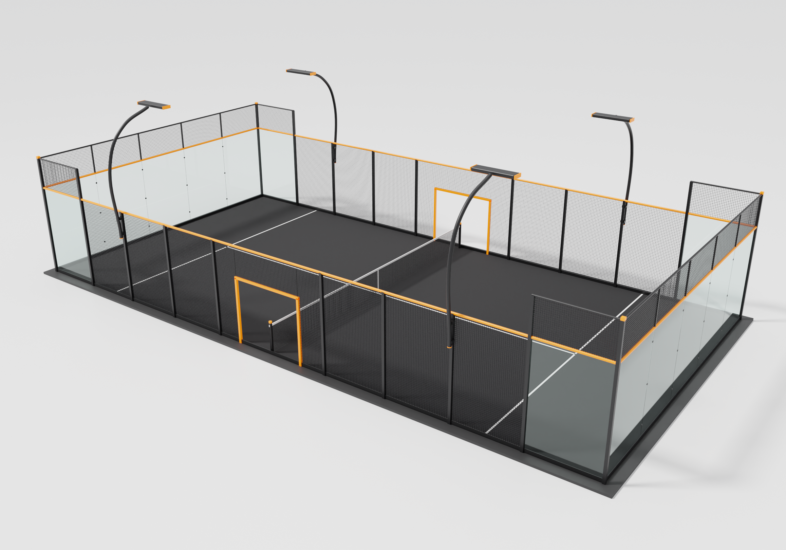

# Render 3D — Cancha de Pádel Panorámica

Render profesional de una cancha de pádel de diseño moderno, generado 100%
por código con Blender (Cycles) en modo headless.



## Concepto de diseño

- **Paleta**: negro mate (estructura y césped), blanco (líneas reglamentarias
  y banda de red) y **naranjo flúor** (riel perimetral a 3 m, marcos de
  acceso, remates de postes y detalles de luminarias).
- **Tipología**: cancha **panorámica** — fondos de vidrio templado de 12 mm
  sin postes intermedios, con fijaciones puntuales tipo botón.
- **Accesos**: una única puerta amplia (2,3 m) por lado, completamente
  abierta, con marco naranjo flúor; todo el resto sin vidrio va enrejado.
- **Iluminación**: 4 brazos curvos tipo "swan neck" con barra LED, montados
  sobre la propia estructura (no anclados al suelo).

## Especificaciones reglamentarias (FIP) modeladas

| Elemento | Medida |
|---|---|
| Área de juego | 20 m × 10 m |
| Vidrio fondos y esquinas | 3 m de altura |
| Malla sobre vidrio (fondos/esquinas) | hasta 4 m |
| Malla laterales zona central | 3 m (paso 50×50 mm) |
| Red | 10 m × 0,88 m, banda superior blanca |
| Líneas de saque | a 6,95 m del eje de la red, 50 mm blancas |
| Accesos | una apertura amplia de 2,3 m por lateral, junto a la red |

## Archivos

- `court_render.py` — script paramétrico que construye toda la escena
  (geometría, materiales PBR, iluminación de estudio y cámara) y renderiza.
- `out/` — renders generados (día, noche, detalle).

## Uso

```bash
# instalar bpy (Blender como módulo de Python 3.11)
python3.11 -m venv /opt/bpyenv && /opt/bpyenv/bin/pip install bpy==4.5.10

# render: <ancho> <alto> <muestras> <salida.png> [day|night] [hero|low|net]
/opt/bpyenv/bin/python court_render.py 2400 1680 200 out/padel_hero_day.png day hero
/opt/bpyenv/bin/python court_render.py 2400 1680 220 out/padel_hero_night.png night hero
```
